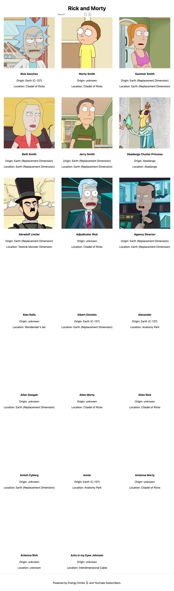

<h1>NextJS GraphQL Crash Course</h1>

<h4>CreatedAt:17th Dec 2021</h4> 

## Detail of the project

This project is NEXT.js GraphQL Crash Course in Youtube.

Next.js Crash Course: James Perkins
https://www.youtube.com/watch?v=tE3WOGIJ1mI

## Screen Shot

## Purpose of the project

Get the knowledge of Next.js Fundamentals and how to connect with GraphQL

## Demo

https://nextjs-with-graphql-nkl2qqn86-hiros-dev.vercel.app/

## What did I learn from this project?

Next.js Fundamentals

How to use Next.js with Chakra UI

How to use Next.js with GraphQL

## Impressions

It is my first Next.js project with GraphQL.
(It is my first time to use Chakra UI, also)

These days, I am learning GraphQL and I noticed GraphQL is terrific.
I would like to know more about GraphQL, so I took the Course.

Against all expectations, this course does not teach about GraphQL.
But, anyway, I am generally satisfied with the content.
(Of course, I would like to learn more about GraphQL though)

Thank you for reading. And, happy coding!!!
